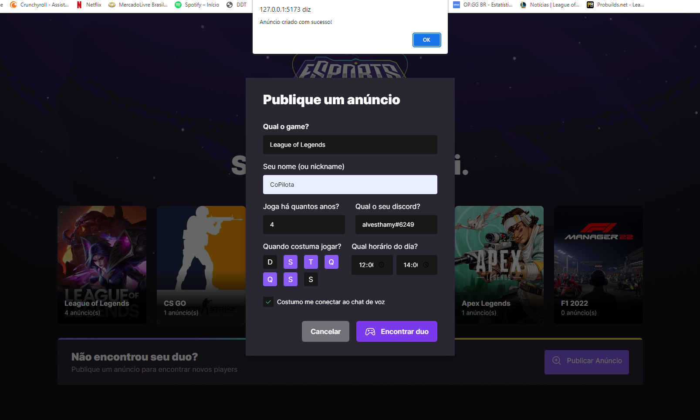
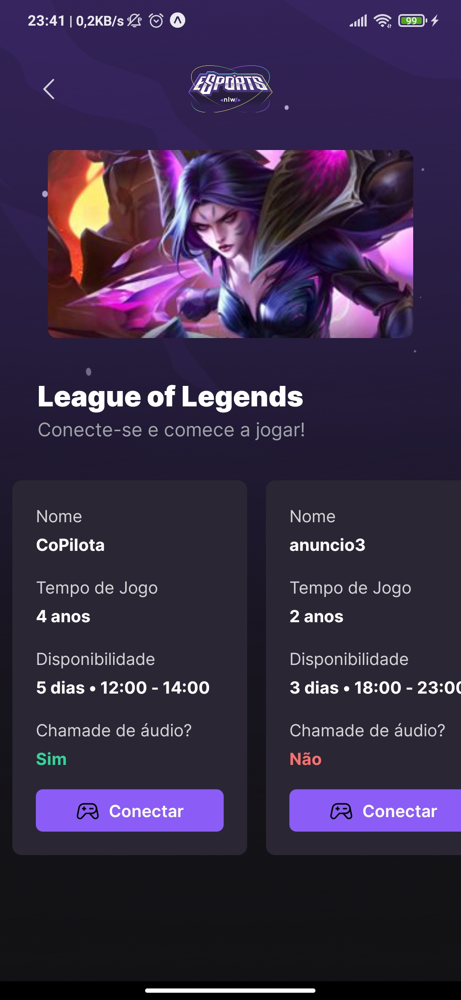
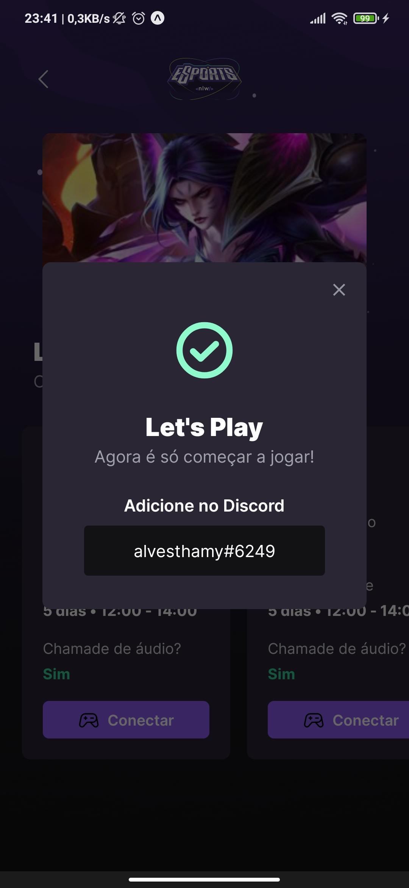

# NLW e-Sports Rocketseat

> Trilha Ignite

Projeto construído no evento Next Level Week da Rocketseat.

## Pagina Web

## App Mobile
    

## 🛠 Tecnologias

- HTML
- CSS
- ReactJS
- NodeJS
- Reactive Native
- Git e GitHub

## 💬 Contato

thamyres_alves.14@hotmail.com

## ToDo - Web 
  
  - Configurar a responsividade
  - Cadastrar mais games e incluir um carrossel: sugestão do Diego é o Keen-Slider 
  - Trocar o componente do select de nativo do HTML para o Radix
  - Validações antes de publicar o anuncio no BD: sugestão do Diego á o React Hook Form 
  - Atenticação(Twitch/Discord

## ToDo - Mobile

  - Implementar Notificações no app pelo Back end
  
